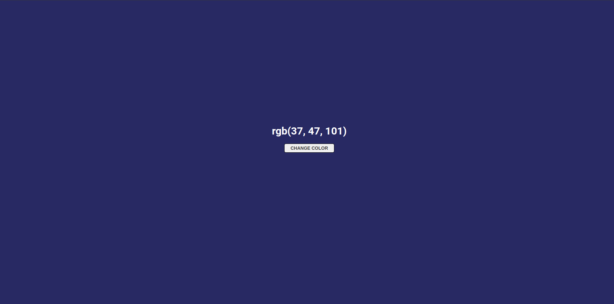

## About
JavaScript study from bootcamp web, if the background color is dark the font is white and if the background is light the font is black, when clicking on the button, random colors are generated in rgb.

